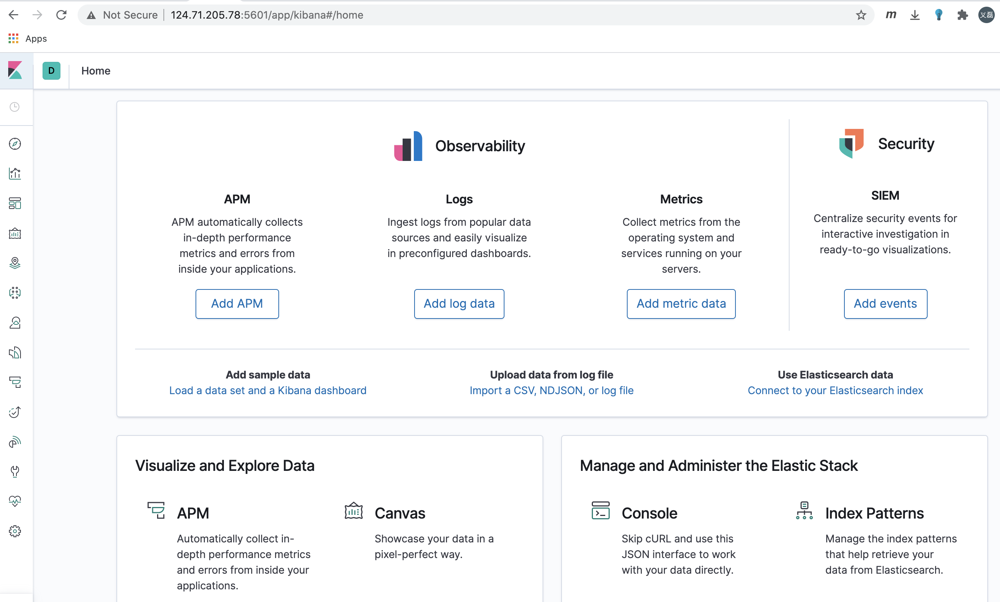
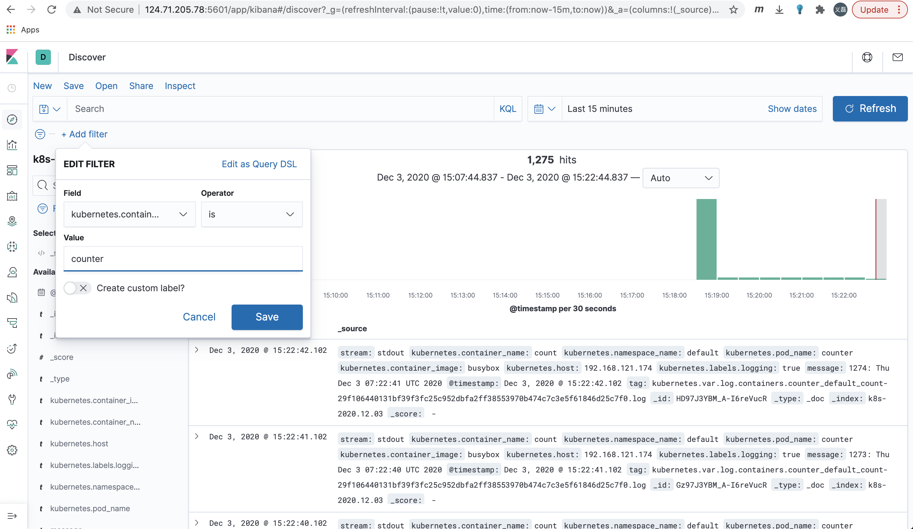

# CCE上创建EFK
前言，本文目的是帮忙年轻人快速在华为云容器上部署EFK。

文中步骤和指导均参考阳明的博客，具体技术细节和原理请移步 https://www.qikqiak.com/post/install-efk-stack-on-k8s/

因为华为公有云容器服务提供的在容器存储，网络和服务暴露等提供了更多更便捷的选项。所以文中做了相应的实操指导。所有yaml文件都已上传。

年轻人，耗子喂汁

## 实验环境

实验环境版本：

在CCE服务中创建3个工作节点的集群
Kubernetes：v1.17.9
VPC网络模式


把如下镜像推送到华为云SWR服务
Elasticsearch 镜像：docker.elastic.co/elasticsearch/elasticsearch:7.6.2
Kibana 镜像：docker.elastic.co/kibana/kibana:7.6.2
Fluentd 镜像：quay.io/fluentd_elasticsearch/fluentd:v3.0.1

## 创建 Elasticsearch 集群

创建一个名为 logging 的 namespace

先创建一个名为 elasticsearch 的无头服务
```
kubectl apply -f elasticsearch-svc.yaml
```
现在我们已经为 Pod 设置了无头服务和一个稳定的域名.elasticsearch.logging.svc.cluster.local，接下来我们通过 StatefulSet 来创建具体的 Elasticsearch 的 Pod 应用。

Kubernetes StatefulSet 允许我们为 Pod 分配一个稳定的标识和持久化存储，Elasticsearch 需要稳定的存储来保证 Pod 在重新调度或者重启后的数据依然不变，所以需要使用 StatefulSet 来管理 Pod。

CCE服务目前支持块，文件，对象等多种存储，支持自动创建PVC。这次选用文件类型作为持久化存储
```
volumeClaimTemplates:
- metadata:
    name: efk-data
    namespace: logging
    annotations: {}
    enable: true
    spec:
    accessModes:
        - ReadWriteMany
    resources:
        requests:
        storage: 30Gi
    storageClassName: csi-nas 
```
创建Elasticsearch StatefulSet
```
kubectl apply -f elasticsearch-statefulset.yaml
```
## 创建Kibana服务
Elasticsearch 集群启动成功了，接下来我们可以来部署 Kibana 服务。参见kibana.yaml

其中我们定义了两个资源对象，一个 Service 和 Deployment，我们将 Service 设置为了 LoadBalander 类型，Kibana Pod 中配置都比较简单，唯一需要注意的是我们使用 ELASTICSEARCH_HOSTS 这个环境变量来设置Elasticsearch 集群的端点和端口，直接使用 Kubernetes DNS 即可，此端点对应服务名称为 elasticsearch，由于是一个 headless service，所以该域将解析为3个 Elasticsearch Pod 的 IP 地址列表
配置完成后，直接使用 kubectl 工具创建：
```
$ kubectl create -f kibana.yaml
service/kibana created
deployment.apps/kibana created
```
运气好的话，一分钟后就能看到如下欢迎页面


## 部署 Fluentd

没什么太复杂的地方，唯一要注意一下两点
### 过滤
由于 Kubernetes 集群中应用太多，也还有很多历史数据，所以我们可以只将某些应用的日志进行收集，比如我们只采集具有 logging=true 这个 Label 标签的 Pod 日志，这个时候就需要使用 filter，如下所示：
```
# 删除无用的属性
<filter kubernetes.**>
  @type record_transformer
  remove_keys $.docker.container_id,$.kubernetes.container_image_id,$.kubernetes.pod_id,$.kubernetes.namespace_id,$.kubernetes.master_url,$.kubernetes.labels.pod-template-hash
</filter>
# 只保留具有logging=true标签的Pod日志
<filter kubernetes.**>
  @id filter_log
  @type grep
  <regexp>
    key $.kubernetes.labels.logging
    pattern ^true$
  </regexp>
</filter>
```
老规矩 
```
kkubectl create -f fluentd-configmap.yaml
configmap "fluentd-config" created
$ kubectl create -f fluentd-daemonset.yaml
serviceaccount "fluentd-es" created
clusterrole.rbac.authorization.k8s.io "fluentd-es" created
clusterrolebinding.rbac.authorization.k8s.io "fluentd-es" created
daemonset.apps "fluentd-es" created 
```
Fluentd 启动成功后，这个时候就可以发送日志到 ES 了，但是我们这里是过滤了只采集具有 logging=true 标签的 Pod 日志，所以现在还没有任何数据会被采集。

下面我们部署一个简单的测试应用， 新建 counter.yaml 文件，文件内容如下：
```
apiVersion: v1
kind: Pod
metadata:
  name: counter
  labels:
    logging: "true"  # 一定要具有该标签才会被采集
spec:
  containers:
  - name: count
    image: busybox
    args: [/bin/sh, -c,
            'i=0; while true; do echo "$i: $(date)"; i=$((i+1)); sleep 1; done']
```
该 Pod 只是简单将日志信息打印到 stdout，所以正常来说 Fluentd 会收集到这个日志数据，在 Kibana 中也就可以找到对应的日志数据了
```
$ kubectl create -f counter.yaml
```
Pod 创建并运行后，回到 Kibana Dashboard 页面，点击左侧最下面的 management 图标，然后点击 Kibana 下面的 Index Patterns 开始导入索引数据：

在这里可以配置我们需要的 Elasticsearch 索引，前面 Fluentd 配置文件中我们采集的日志使用的是 logstash 格式，定义了一个 k8s 的前缀，所以这里只需要在文本框中输入k8s-*即可匹配到 Elasticsearch 集群中采集的 Kubernetes 集群日志数据，然后点击下一步，进入以下页面：

在该页面中配置使用哪个字段按时间过滤日志数据，在下拉列表中，选择@timestamp字段，然后点击Create index pattern，创建完成后，点击左侧导航菜单中的Discover，然后就可以看到一些直方图和最近采集到的日志数据了, 添加过滤。
现在的数据就是上面 Counter 应用的日志，如果还有其他的应用，我们也可以筛选过滤：

我们也可以通过其他元数据来过滤日志数据，比如您可以单击任何日志条目以查看其他元数据，如容器名称，Kubernetes 节点，命名空间等。
